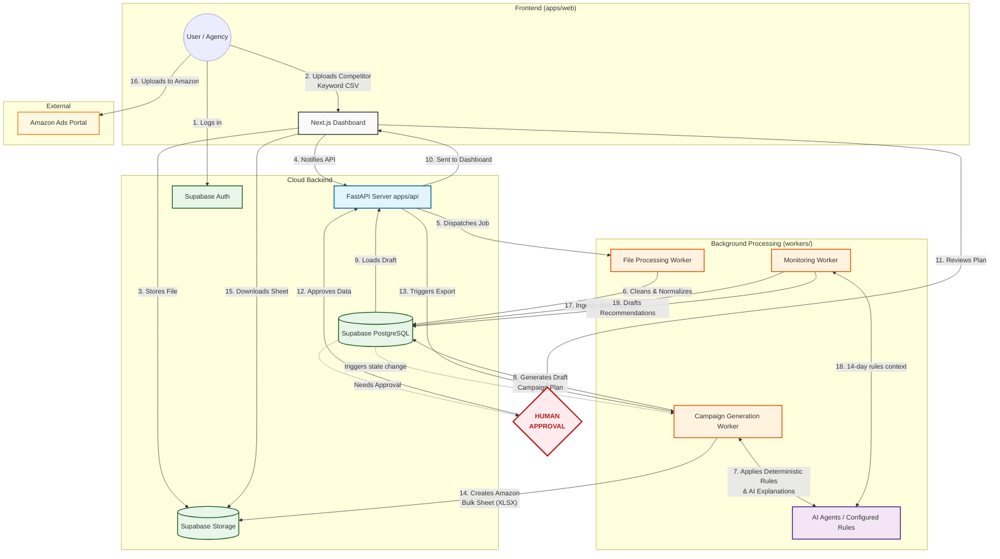

# AdSurf Architecture & Workflow Flowchart

This diagram illustrates the complete end-to-end flow of the Amazon Ads AI Automation Control Center, emphasizing the "Human Approval" boundary and the MVP Bulk Sheet export requirement.

